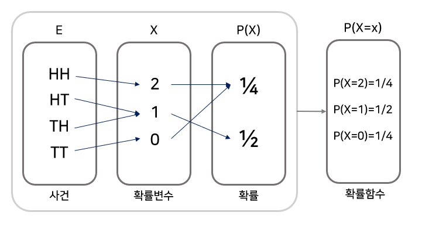

# 용어정리
### 표본공간(Sample Space)
모든 결과값들의 모임
e.g.,  S = {1,2,3,4,5,6} (주사위)
### 근원사건(Sample Outcome)
표본공간의 원소
e.g., [1,2,3,4,5,6] (주사위)
### 사건(Event)
표본공간의 부분집합
e.g., 홀수가 나오는 사건 = {1,3,5} (주사위)

### 확률변수
표본공간을 어떠한 의미를 가진 실수에 대응시키는 함수

### 확률분포
확률변수에서의 실수들을 확률에 대응시키는 함수

(예시)

출처 : https://dlearner.tistory.com/32