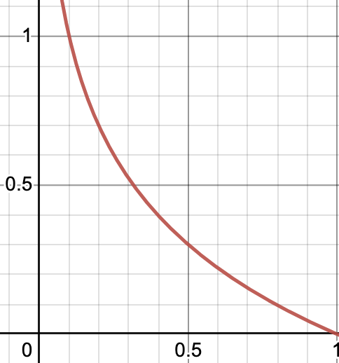

Entropy 
정보는 0과 1, bits로 나타낼 수 있다.
Entropy는 이 정보를 최소한의 bits로 표현하고자 할 때, 정보를 표현하는 데 필요한 최소 평균 자원량(lower bound)를 의미한다.

등장 빈도가 높은 정보는 적은 bits로 나타내고, 반대의 경우에는 큰 bits로 나타낼 때 효율적이라 할 수 있겠다.
e.g., 많은 사용하는 표현을 최소한의 비트로 표현 

엔트로피를 그래프로 나타내면 다음과 같다.

(x축 : 확률, y축 : 길이)

엔트로피는 정보를 표현하는 데 필요한 최소 평균 자원량이기 때문에 다음과 같이 나타낼 수 있다.
Entropy = $\sum_{i}^{}p_{i}(-log_{2}p_{i})$