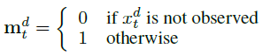
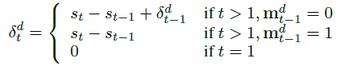
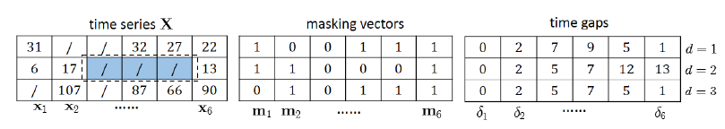
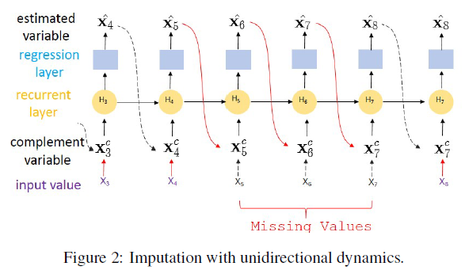
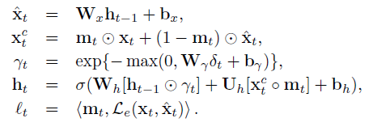
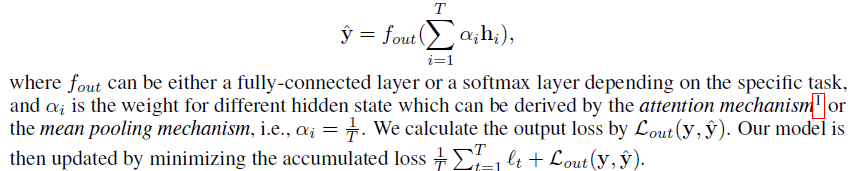

## Abstract
time series 데이터는 많은 분야에서 사용되며, 이러한 시계열 데이터에는 많은 결측값이 포함되어 있다. 결측값 문제를 해결하기 위해 많은 연구가 진행되었고, 본 논문은 Time series data에서 Imputation을 위한 RNN 기반의 새로운 방법인 BRITS를 제안한다.

BRITS의 장점은 다음과 같다.
1.상관관계가 있는 여러 결측값을 처리할 수 있다.
2.Nonlinear Dynamics 기반이 되는 Time series로 일반화 한다.
3.Data를 기반으로 Imputation을 실시하며, 결측값이 있는 일반적인 상황에서도 사용된다.

## Preliminary
- T 시점에서의 multivariate time series X는 다음과 같이 표기한다.
$X = [ x_{1},x_{2},\cdots ,x_{T}]$
- t-th observation $x_{t}\in \mathbb{R}^{D}$는 t 시점의, D개의 변수들에 대한 값을 나타낸다.
- 실제 데이터에서는 결측값이 존재할 수 있다. 결측값을 나타내기 위해 masking vector를 사용한다.

- current timestamp $s_{t}$와 last observation 간의 time gap $\delta_{t}^{d} $을 다음과 같이 정의한다.

e.g.,)

## BRITS
### Unidirectional Uncorrelated Recurrent Imputation

-여기서는 각 변수 간 상관관계가 나타나지 않는다고 가정하는 RITS-I를 제안한다.

-아래 그림의 경우, 데이터가 x1~x10까지 존재하고 x5,x6,x7 값은 누락된 상태이다. recurrent dynamics에 따르면 각 time step t에서는 이전 t-1 step을 바탕으로 추정 값 $\hat{x_{t}}$을 얻을 수 있다. 이를 바탕으로 x1~x4에서는 추정 값과 실제 값 간의 loss를 구할 수 있게 된다. 하지만 t = 5,6,7에서는 값이 존재하지 않기 때문에 error를 바로 구할 수 없다. 하지만 t=8에서의 추정값은 이전 step의 추정 값에 의존한다. 따라서 t=8 시점에서는 t=5,6,7의 지연된 에러를 얻는다.()

#### Algorithm
본 논문에서는 standard recurrent network를 사용한다.
$h_{t} = \sigma (W_{h}h_{t-1}+ U_{h}x_{t}+b_{h})$
그러나 $x_{t}$값이 missing value일 수 있기 때문에 위의 식을 그대도 사용하는 데에는 어려움이 존재한다. 따라서 $x_{t}$값이 missing value일 경우, complement input $x_{t}^{c}$를 사용한다.

- Eq.(1)은 hidden state $h_{t-1}$을 바탕으로 
$\hat{x}_{t}$를 추정한다.
- Eq.(2)에서는 xt가 missing value일 때 이를 $\hat{x}_{t}$으로 대체한다.
- Eq.(3)에서는 $h_{t-1}$를 decay하기 위해 temporal decay factor $\gamma_{t}$를 도입한다.
- Eq.(4)에서는 앞서 구한 decay factor를 바탕으로 $h_{t}$를 구한다.
- estimation error를 계산하기 위해 MSE를 loss로 사용한다.
- 최종적으로 task label y는 다음과 같이 구해진다.

<정리>
이전 hidden state를 바탕으로 t시점의 추정값을 구하고(Eq 1), 실제로 missing value일 경우 앞서 구한 추정값을 사용한다(Eq 2). 또 observation time interval을 고려하여 temporal decay factor를 구하고(Eq 3), 이를 바탕으로 hidden state를 계산한다(Eq 4). observation time interval이 커질수록 영향력이 작아진다는 점을 반영하기 위해 decay factor를 추가했다고 생각된다.

#### Practical Issues
실재로 RNN은 gradient vanishing problem이 존재하기 때문에 불안정하다.

### Bidirectional Uncorrelated Recurrent Imputation(BRITS-I)
RITS-I에서는 estimated missing value에 대한 error가 다음 observation이 등장하기 까지 delay 되어진다.
이러한 문제를 해결하기 위해 bidirectional recurrent를 사용한다.
이전에 언급했던 예시를 다시 가져오면, t=5 에서의 에러가 t=8의 forward direction 뿐만 아니라 t=4의 backward direction에도 영향을 받는다. 이렇게 forward, backward에 대한 두 개의 loss가 생기고 consistency loss를 사용하여 각 direction에 대한 loss를 활용한다.

$l _{t}^{cons} = Discrepancy(\hat{x}_{t},\hat{x'}_{t})$

### Correlated Recurrent Imputation (BRITS)
앞선 모델들은 feature 간 correlation은 존재하지 않는다고 가정했지만 이는 사실이 아니다.