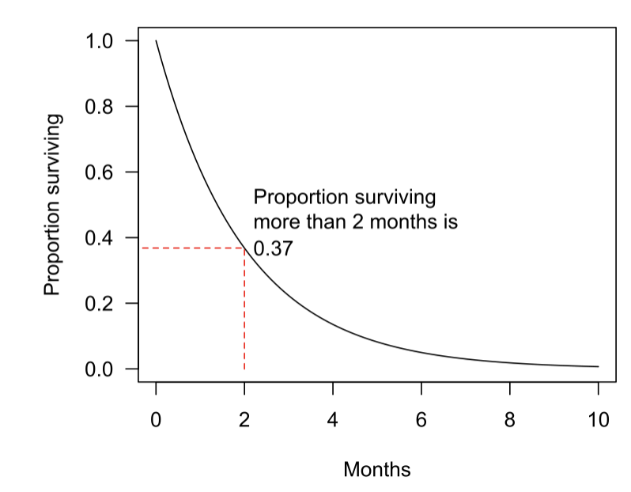

Survival data는 3개의 구성요소를 가진다.
-a patient's baseline data x
-a failure event time T
-an event indicator E(e.g. 사망)

survival analysis에 있어 Survival function과 Hazard function은

확률변수 $T$를 생존시간이라 하고 $f(t)$를 확률밀도함수라 할 때,
특정 시점 t까지 event가 발생했을 확률을 나타내는 $T$의 누적분포함수는 다음과 같이 정의된다.
$F(t) = P(T\leq t)=\int_{0}^{t}f(t)dt$

또한 t시점에서 생존했을 확률을 나타내는 생존함수는 다음과 같이 정의된다.
$S(t) = P(T>t)=1-F(t)$

위험함수(hazard function)
위험함수는 t시점까지는 생존했다고 가정(조건부), 바로 직후에 사망할 확률을 의미한다.

$t_{}^{(n)}= [t_{1},\cdots,t_{j},\cdots,t_{Tn} ]$ : time points of length $t_{Tn}$

$X_{}^{(n)}=[x_{t1}^{(n)},\cdots ,x_{tj}^{(n)},\cdots ,x_{Tn}^{(n)}]\in R_{}^{Tn\times D}$ : observation time series

$x_{tj}^{(n)}\in R_{}^{D}$ : tj-th observation of all variables

$x_{tj,d}^{(n)}$ : element of the d-th variable in $x_{tj}^{(n)}$

the ob

